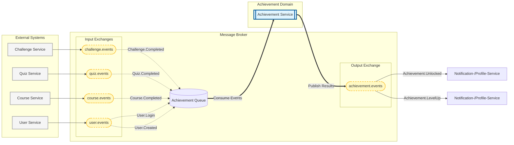

## 1. Überblick: Achievement-Service

**Funktion**: Der **Achievement-Service** verwaltet **Badges** (alle verfügbaren, angefangen, abgeschlossen) trackt **Fortschritt** pro User über XP in Levels und reagiert dafür auf Events von anderen Services (Challenges, Quizzes, Kurse, Logins).

**Architektur**: Der **Achievement-Service** ist als **FastAPI-App** aufgebaut, die sowohl eine **REST-API** anbietet, als auch **Events asynchron verarbeitet**

---

## 2. Rest API

### 2.1 Eingehende Schnittstellen
-  keine, allerdings abonnieren wir diverse Events (siehe 3.3)

## 2.2 Ausgehende Schnittstellen

| Endpoint                 | Methode | Beschreibung                                                            |
| ------------------------ | ------- | ----------------------------------------------------------------------- |
| `/achievements/{userID}` | `GET`   | Liefert User Objekt inklusive aller angefangenen/beendeten Achievements |
| `/achievements/all`      | `GET`   | Liefert alle möglich verfügbare Achievements                            |

**`achivements/UID`-response**

```json
[{
  "user_id": "",
  "level": 4, // int
  "xp": 300, // int
  "achievements": [
    {
      "_id": "quiz_master",
      "name": "Quiz Master",
      "description": "Complete 10 quizzes",
      "category": "QUIZ", // QUIZ, COURSE, STREAK, SEASONAL, DAILY
      "xpReward": 500,
      "repeatable": false,
      "createdAt": ISODate("2025-11-05T09:00:00Z"),
      "image_resource": "<uri>",
      "achievement_id": "",
      "user_id": "",
      "state": "ACTIVE", // COMPLETED, EXPIRED
      "updated_at": "", // Date
      "completed_at": None,
      "progress": 0.5 // double
    },
    { ... }
  ]
}]

```

**`achievements/all`-response**

```json
[
  {
    "_id": "quiz_master",
    "name": "Quiz Master",
    "description": "Complete 10 quizzes",
    "category": "QUIZ", // QUIZ, COURSE, STREAK, SEASONAL, DAILY
    "xpReward": 500,
    "repeatable": false,
    "criteria": [
      {
        "eventType": "QUIZ_COMPLETED",
        "targetValue": 10,
        "metadata": {
          "topic": "any"
        }
      }
    ],
    "createdAt": ISODate("2025-11-05T09:00:00Z"),
    "image_resource": "<uri>"
  },
  { ... }
]

```


---

## 3. Event Management

### 3.1 Event-Architektur




### 3.2 Ausgehende Events

| Event                  | Empfänger                              | Beschreibung               |
| ---------------------- | -------------------------------------- | -------------------------- |
| `ACHIEVEMENT_UNLOCKED` | Profile Service, Notification Service  | Achievement freigeschaltet |
| `LEVEL_UP`             | Notification Service, Profile Service? | Levelaufstieg              |


**`ACHIEVEMENT_UNLOCKED`-Event-Response** 
```json
{
  "eventId": "45b5b1ff-ca4f-4dc2-9129-c65217144acb",
  "eventType": "Achievement.Unlocked",
  "source": "achievement-service",
  "timestamp": "2026-01-06T10:50:58.129745Z",
  "version": "1.0",
  "correlationId": "be41991a-f7f8-4410-bc5a-8c86d5868a2e",
  "payload": {
    "user_id": "123",
    "achievement_id": "692ab569e5892c2f16d33fc8f",
    "achievement_name": "Event Master",
    "message": "Nice, you mastered a new event",
    "xp_reward": 50,
    "xp_total": 150
  }
}
```


**`LEVEL_UP`-Event-Response**
```json
{
  "eventId": "a93df1e8-5158-40a4-911f-e594fd9406d3",
  "eventType": "Achievement.LevelUp",
  "source": "achievement-service",
  "timestamp": "2026-01-06T10:52:27.650740Z",
  "version": "1.0",
  "correlationId": "b0b7ee5d-739c-40fa-b0c0-d2dca001c18c",
  "payload": {
    "user_id": "123",
    "level": 3,
    "message": "Congrats, you reached a new level!"
  }
}
```


### 3.3 Eingehende Events

| Event | Quelle | Beschreibung |
|-------|--------|--------------|
| `CHALLENGE_COMPLETED` | Challenge Service | User hat eine Challenge abgeschlossen |
| `QUIZ_COMPLETED` | Quiz Service | Quiz abgeschlossen |
| `COURSE_COMPLETED` | Kurs Service | Kurs abgeschlossen |
| `USER_LOGIN` | User Service | Login erfolgt |
| `USER_CREATED` | User Service | User erstellt |

